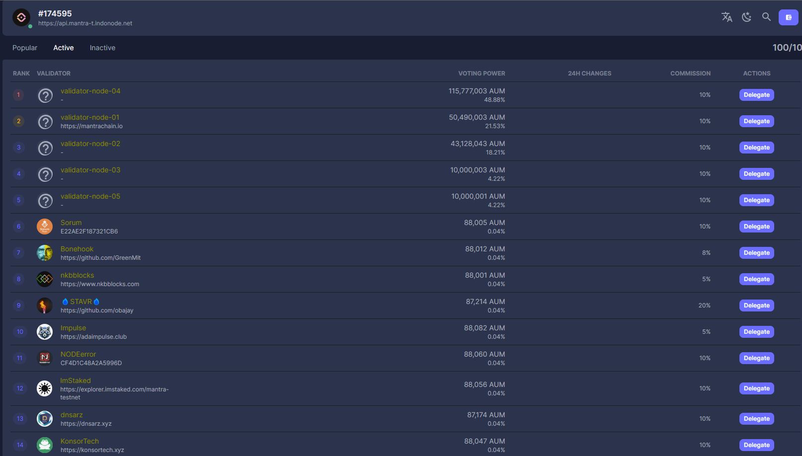

# ✅ mantra

## source

[https://docs.mantrachain.io/operate-a-node/join-testnet/testnet-phase-1#challenges](https://docs.mantrachain.io/operate-a-node/join-testnet/testnet-phase-1#challenges)

## system requirements

#### minimum

```
CPU: 2vCPU (1 core)
Memory: 4 GB
Storage: 200 - 500 GB
```

#### recommended

```
CPU: 4vCPU (2 cores)
Memory: 8 - 16GB
Storage: 500 - 1000 GB
```

## update system & install prerequisites.

```bash
sudo apt update
sudo apt upgrade
sudo apt install -y curl git jq lz4 build-essential unzip

bash <(curl -s "https://raw.githubusercontent.com/MANTRA-Finance/public/main/go_install.sh")
source .bash_profile
```

## install binary.

```bash
mkdir bin
cd bin
source ~/.profile

wget https://<Location to be provided>/mantrachaind-linux-amd64.zip
unzip mantrachaind-linux-amd64.zip
rm -rf mantrachaind-linux-amd64.zip
```

## install cosmwasm library

```bash
sudo wget -P /usr/lib https://github.com/CosmWasm/wasmvm/releases/download/v1.3.0/libwasmvm.x86_64.so
```

## initialise node

```bash
mantrachaind init <your-moniker> --chain-id mantrachain-testnet-1
```

* where `<your-moniker>`is the moniker and can be any valid string name (e.g. `val-01`),
* and `mantrachain-testnet-1` is the Chain ID and must be exactly as specified.

## download "genesis.json" - TESTNET

Obtain the MANTRA Chain `genesis.json` for the MANTRA Chain TESTNET.

```bash
curl -Ls https://<Location to be provided>/genesis.json > $HOME/.mantrachain/config/genesis.json
```

Update the `config.toml` with the seed node and the peers for the MANTRA Chain TESTNET.

<pre class="language-bash"><code class="lang-bash">CONFIG_TOML="$HOME/.mantrachain/config/config.toml"
SEEDS="69fa5f7927f2b013f152b6dfc56324156feb1973@34.172.80.207:26656"
PEERS="182a37a556ff0b6733fe58020e7746de3292492d@35.222.198.102:26656,64691a4202c1ad29a416b21ce21bfc9659783406@34.136.169.18:26656"
sed -i.bak -e "s/^persistent_peers *=.*/persistent_peers = \"$PEERS\"/" $CONFIG_TOML
sed -i.bak -e "s/^seeds =.*/seeds = \"$SEEDS\"/" $CONFIG_TOML
external_address=$(wget -qO- eth0.me)
<strong>sed -i.bak -e "s/^external_address *=.*/external_address = \"$external_address:26656\"/" $CONFIG_TOML
</strong>sed -i 's|^minimum-gas-prices *=.*|minimum-gas-prices = "0.0002uaum"|g' $CONFIG_TOML
sed -i 's|^prometheus *=.*|prometheus = true|' $CONFIG_TOML
sed -i -e "s/^filter_peers *=.*/filter_peers = \"true\"/" $CONFIG_TOML
</code></pre>

## install cosmovisor

```bash
go install cosmossdk.io/tools/cosmovisor/cmd/cosmovisor@v1.4.0
mkdir -p ~/.mantrachain/cosmovisor/genesis/bin
mkdir -p ~/.mantrachain/cosmovisor/upgrades
cp ~/bin/mantrachaind ~/.mantrachain/cosmovisor/genesis/bin
```

## configure "mantrachaind" as a service

```bash
sudo tee /etc/systemd/system/mantrachaind.service > /dev/null << EOF
[Unit]
Description=Mantra Node
After=network-online.target
[Service]
User=$USER
ExecStart=$(which cosmovisor) run start
Restart=on-failure
RestartSec=3
LimitNOFILE=10000
Environment="DAEMON_NAME=mantrachaind"
Environment="DAEMON_HOME=$HOME/.mantrachain"
Environment="DAEMON_ALLOW_DOWNLOAD_BINARIES=false"
Environment="DAEMON_RESTART_AFTER_UPGRADE=true"
Environment="UNSAFE_SKIP_BACKUP=true"
[Install]
WantedBy=multi-user.target
EOF
```

## starting, stoping and restarting service

<pre class="language-bash"><code class="lang-bash"><strong>#reload, enable and start
</strong><strong>sudo systemctl daemon-reload
</strong>sudo systemctl enable mantrachaind
sudo systemctl start mantrachaind

#stop
sudo systemctl stop mantrachaind
​
#restart
sudo systemctl restart mantrachaind

#logs
sudo journalctl -xefu mantrachaind
​
#logs - filtered on block height lines
sudo journalctl -xefu mantrachaind -g ".*txindex"

</code></pre>

Once started, the node will take some time to sync with the blockchain.  \
\
Visit [https://explorer.testnet.mantrachain.io/mantrachain](https://explorer.testnet.mantrachain.io/mantrachain) to see the current height of the blockchain.  Use the `journalctl` command to check on the node's progress.

## convert node into a validator

You can, either, create a new account or import an existing account.

### **create keys**

Create a key file.&#x20;

<pre class="language-bash"><code class="lang-bash"><strong>mantrachaind config keyring-backend file
</strong></code></pre>

Generate a new public key with mnemonic phrase.

```bash
mantrachaind keys add <your-moniker-keys>
```

where `<your-moniker-keys>`is the moniker and can be any valid string name  (e.g. `validator01-keys`)

The above command will produce output like this:

```
- address: mantra1q55nrzygas0nespfu8mwt2yntq8gxll3kyug82
  name: validator01-keys
  pubkey: '{"@type":"/cosmos.crypto.secp256k1.PubKey","key":"A/YebpAX8AqUNcNXcqIy53fJo8BGFCSaQA5A0XQWMlCG"}'
  type: local
	
	
**Important** write this mnemonic phrase in a safe place.
It is the only way to recover your account if you ever forget your password.
	
expect kid unfair uniform calm debris meadow despair vintage arrive walnut vast upset cart step funny truth vault naive note capable spray shine human
```

_**KEEP THE MNEMONIC PHRASE IN A SAFE PLACE!**_

### **import keys**

Alternatively, if you already have an existing mnemonic that you'd like to use, then run the following:

```bash
$ mantrachaind keys add <your-moniker-keys> --recover
```

### faucet

[https://faucet.testnet.mantrachain.io/](https://faucet.testnet.mantrachain.io/)

1 IP address can get 1uaum every 24 hours. In case you need to transfer uaum tokens between wallets, follow this command

```
mantrachaind tx bank send sender_address receiver_address amount_to_send --gas="auto" --gas-adjustment 2 --gas-prices="0.0001uaum" -y
```

Replace `sender_address` `receiver_address` `amount_to_send` with your values

### execute "create-validator" transaction

You can create new validator from the public key of your node with the following command:

```bash
mantrachaind tx staking create-validator \
  --amount=1000000uaum \
  --pubkey=$(mantrachaind tendermint show-validator) \
  --moniker=<MONIKER> \
  --chain-id=mantrachain-testnet-1 \
  --commission-rate="0.10" \
  --commission-max-rate="0.20" \
  --commission-max-change-rate="0.01" \
  --min-self-delegation="1000000" \
  --gas="auto" \
  --gas-adjustment 2 \
  --gas-prices="0.0001uaum" \
  --from=<KEY-NAME>
```

### execute "edit-validator" transaction

<pre class="language-bash"><code class="lang-bash">mantrachaind tx staking edit-validator \
  --new-moniker=&#x3C;NEW-MONIKER> \
  --website="https://your-website.com" \
<strong>  --details="Some impressive info about your validator." \
</strong>  --chain-id=mantrachain-testnet-1 \
  --commission-rate="0.10" \
  --gas="auto" \
  --gas-adjustment 2 \
  --gas-prices="0.0001uaum" \
  --from=&#x3C;KEY-NAME>
</code></pre>

## explorer

[https://explorer.indonode.net/mantra-testnet/staking](https://explorer.indonode.net/mantra-testnet/staking)

[https://explorer.testnet.mantrachain.io/mantrachain](https://explorer.testnet.mantrachain.io/mantrachain)

<figure><figcaption></figcaption></figure>


